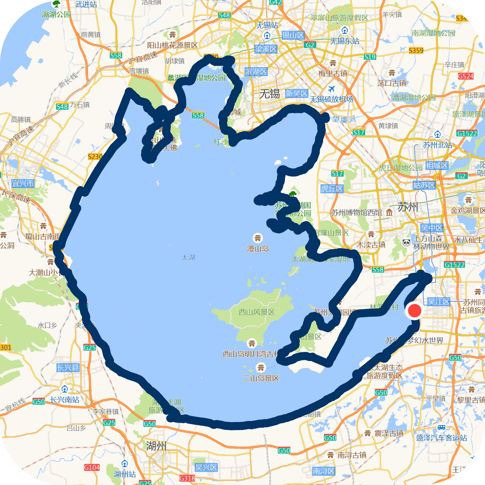

# trace-video-overlay

从 GPS 轨迹生成两种视频剪辑素材：一张透明背景的轨迹图 PNG，或者一个代表「当前位置」的小圆点沿轨迹匀速移动的 MP4。填入自己的高德 API Key 后（免费申请），可以在素材里的轨迹下面额外叠一层高德的静态地图。静态地图会展示街道、河流、地名等地图信息。

**在线使用**：https://hcazrej.github.io/trace-video-overlay/

## Demo

环太湖骑行一圈，4 段 FIT 按顺序拼接、叠加高德底图后导出的 PNG 与 MP4 动画：

<table>
<tr>
<td width="50%"></td>
<td width="50%"><video src="https://github.com/user-attachments/assets/2e7133dd-3ed5-484b-8c1e-2faa18b061c9" width="100%" controls muted></video></td>
</tr>
</table>

## Features

- 六种轨迹格式在浏览器里解析：GPX、KML、TCX、FIT、GeoJSON、CSV。文件不上传服务器。
- 多个轨迹文件按加载顺序首尾拼接成一条轨迹。
- 导出三种素材，分辨率 720 / 1080 / 1440 通用：
  - 透明背景的轨迹图 PNG，底色透明度、圆角、内边距可调。
  - 单独一张「当前位置」小圆点 PNG，供在剪辑软件里对它打位置关键帧沿轨迹移动。
  - MP4 动画，小圆点沿轨迹从起点匀速移动到终点，用 WebCodecs `VideoEncoder` 加一份 vendored 的 mp4-muxer 编码。
- 可选叠加一层高德静态地图作为底图。默认关闭，需要用户手动勾选并填入自己的高德 Web 服务 API Key 才启用；境内点位用国测局公式（WGS84 → GCJ-02）自动转换后再投影，避免中国境内地图错位。
- 无 build 步骤、无 npm 依赖、无后端，源码直接由 GitHub Pages 托管。

## Usage

打开 [在线站点](https://hcazrej.github.io/trace-video-overlay/)，拖入一个或多个轨迹文件，调整样式，点击导出。

想在本地跑代码，启动一个静态服务器：

```
python3 -m http.server 8137
```

然后访问 `http://localhost:8137/`。页面用 ES module 装载代码，需要经 HTTP 打开。

## Project Structure

| 路径 | 内容 |
|---|---|
| `index.html` | HTML 结构骨架，样式与脚本都从外部文件装载。 |
| `styles/` | 六份 CSS：设计变量、基础样式、布局、表单控件、组件、取色器。按 `<link>` 顺序层叠。 |
| `src/core/` | 零浏览器 API 的纯函数，Node 与浏览器共用同一份：Web Mercator 投影、WGS84 → GCJ-02 坐标转换、高德静态地图 URL 构造与对齐数学、轨迹平滑与拼接、几何计算（`dotGeometry`、`pointAtProgress`）、指标计算（距离、时长、均速、配速、爬升）、颜色空间互转。 |
| `src/parse/` | 六种轨迹格式的解析：`index` 按扩展名分派，`fit` 解 FIT 二进制，`geojson` / `csv` 纯文本，`xml` 处理 GPX / TCX / KML。 |
| `src/basemap/` | 高德静图的取图、内存缓存、错误码翻译。 |
| `src/render/` | Canvas 绘制：描边与标记、卡片（预览与逐帧同构）、定位点。 |
| `src/export/` | 产物出口：PNG 下载、MP4 编码管线（含取消与关页拦截）、导出状态条。 |
| `src/ui/` | 唯一操作界面 DOM 的一层：预览编排、地图面板、轨迹列表、失败提示与撤销、滑杆联动、自定义取色器。 |
| `src/main.mjs` | 装配入口：import、事件绑定、首屏初始化。 |
| `vendor/mp4-muxer.js` | Vendored [Vanilagy/mp4-muxer](https://github.com/Vanilagy/mp4-muxer)，把 WebCodecs 编码出的 chunk 封装成 MP4 容器。 |
| `tests/` | `node:test` 测试，覆盖纯逻辑与页面结构。 |

## Testing

需要 Node v22+：

```
node --test 'tests/**/*.test.mjs'
```

## License

[PolyForm Noncommercial 1.0.0](LICENSE)。禁止商用。
